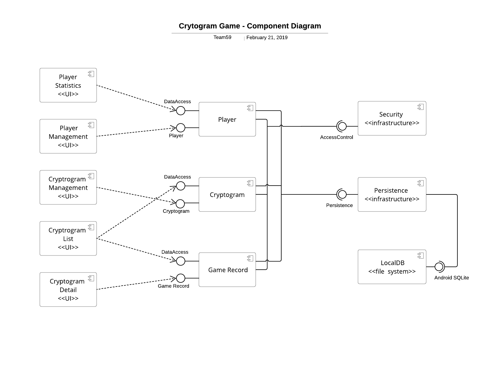
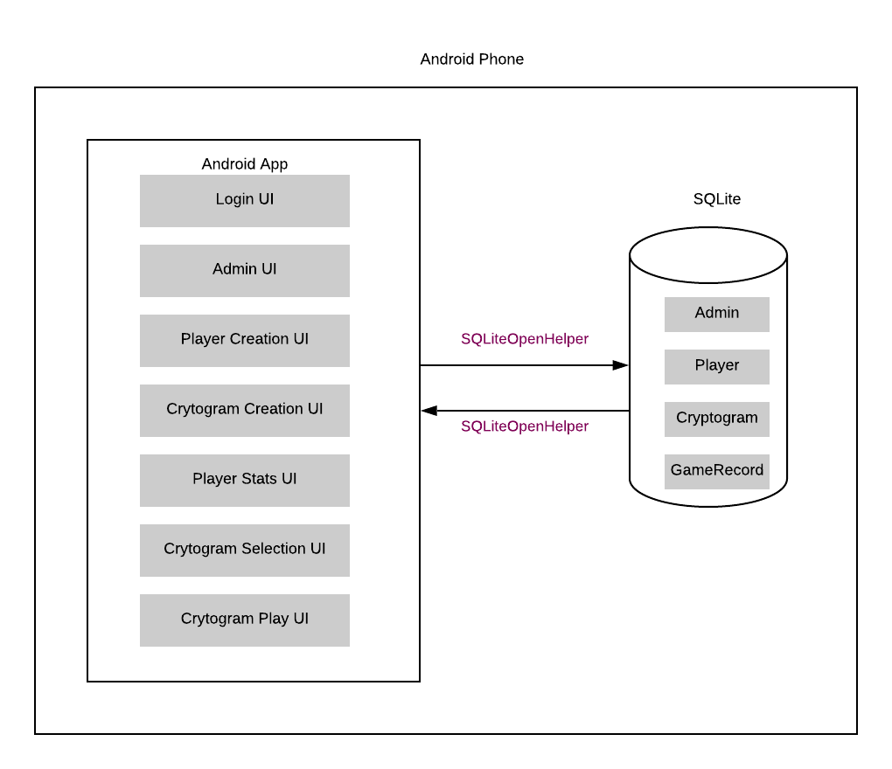
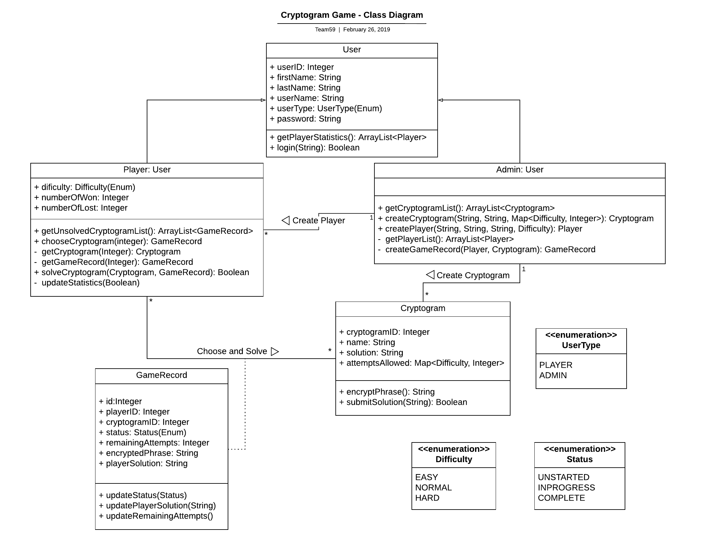
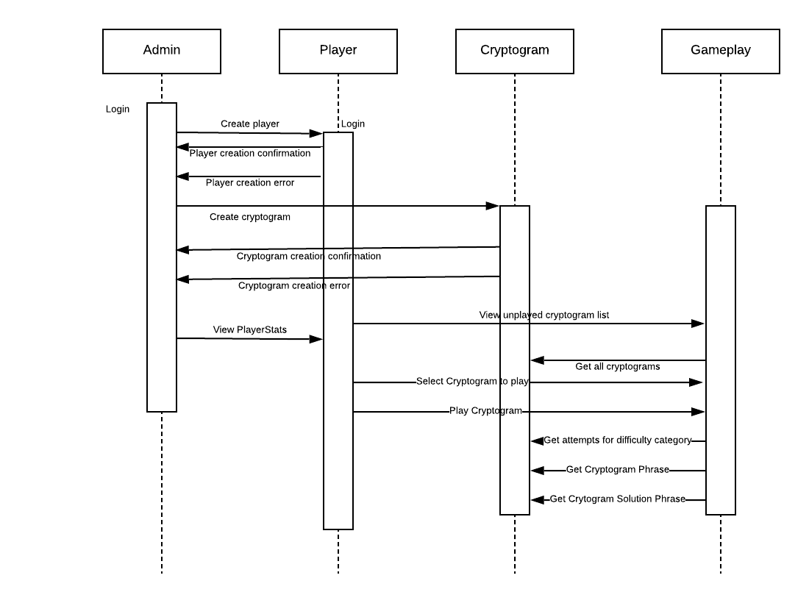
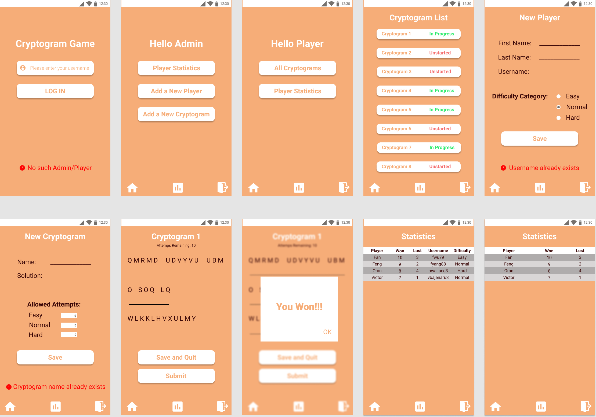

# Design Document

## 1 Design Considerations

### 1.1 Assumptions

- This is an Android application which can only be run on an Android device.
- This application will be run on a single Android device with no network needed.
- No authentication needed for login
- Android Sqlite is used as a serverless database and all the data is saved as local files on the device.
- Data may not be persistent if the application crashes, the device operating system crashes or the device malfunctions.
- There are multiple players and only one admin.
- Only one player can operate on this application at a time.

### 1.2 Constraints

- The authentication is not needed for login, which decides if the password or even password encryption needs to be considered.
- The list of unsolved cryptograms is unique for each player.
- The encrypted phrase of a cryptogram is randomly generated for each player.
- The player can continue working on a previously started cryptogram which means the intermediate status of each cryptogram must be saved for each player.

### 1.3 System Environment

- Requires Android 6.0 and later.
- Compatible with Android phones and tablets.

## 2 Architectural Design

### 2.1 Component Diagram

There are five UI components in this system: Player Statistics, Player Management, Cryptogram Management, Cryptogram list and Cryptogram Detail. Theses UI components either use or retrieve data from the components Player, Cryptogram and Game Record. "Player Statistics" UI gets data from "Player". "Player Management" UI uses "Player" component to create and save a new player to the system. "Cryptogram Management" UI uses "Cryptogram" component to create and save a new cryptogram to the system. "Cryptogram List" UI gets data from "Cryptogram" component for an "admin" typed user, and gets data from "Game Record" component for a "player" typed user. "Cryptogram Detail" UI uses "Game Record" component to retrieve or update a cryptogram's information for a player.

"Security" infrastructure is used to handle the log in process of a user based on the user's user type and user name. The persistence of data is implemented by storing all the data in the file system of the device on which this application runs. The write/read of the data is implemented using Android SQLite.

### 2.2 Deployment Diagram

The system is purely deployed on a single Android device thus there is no client-server communication. Inside the device, there are majorly two layers: UI layer and DB(SQLit) layer.

## 3 Low-Level Design

### 3.1 Class Diagram

### 3.2 Other Diagrams

Below is a sequence diagram indicating the interactions between different objects in a sequential manner. Self interactions such as Player view players' stats are not depicted in the diagram.

## 4 User Interface Design

