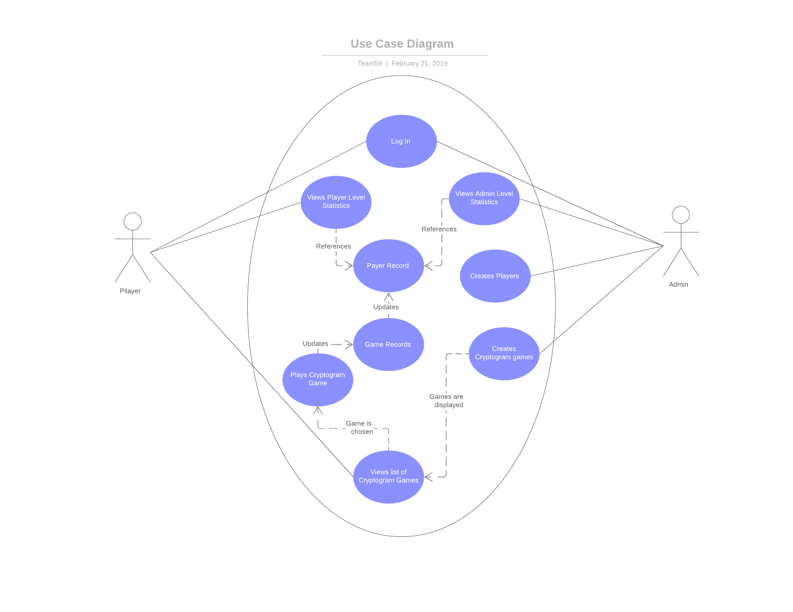

# Use Case Model

## 1 Use Case Diagram

## 2 Use Case Descriptions

Usecase 1:
 * Requirements:  Allow Admin or Player to login
 * Pre-conditions: Admin/Player were created
 * Post-conditions: Admin/Player logged in successfully or error shown
 * Scenarios: Admin/Player types in username and click login. If username exists, they should login successfully. If not, the following error should be shown: "No such Admin/Player".
 
Usecase 2:
 * Requirements:  Allow Admin to create Player
 * Pre-conditions: Admin logged in
 * Post-conditions: Player created successfully or error shown
 * Scenarios: Admin clicks create player button. Player creation screen should be shown. After filling out needed information and click "create", a Player object should be created and stored in database if username is unique. Otherwise, the following error message should be shown: "Username already exists".
 
Usecase 3:
 * Requirements:  Allow Admin to create Cryptogram
 * Pre-conditions: Admin logged in
 * Post-conditions Cryptogram created successfully or error shown
 * Scenarios: Admin clicks create Cryptogram button. Cryptogram creation screen should be shown. After filling out needed information and click "create", a Cryptogram should be created and stored in database if cryptogram name is unique. Orelse error message should be shown "Cryptogram name already exists".

Usecase 4:
 * Requirements:  Allow Player to view player stats
 * Pre-conditions: Player logged in
 * Post-conditions: Display player stats by descending order of the number of Cryptogram won.  To be displayed are the following: first name, the number of cryptograms won, and the number of cryptograms lost.
 * Scenarios: Player clicks "view player stats" button. All player stats mentioned in post-conditions above will be shown ordered by descending order with the number of Cryptogram won. No order guarantee on subgroups that have the same number of Cryptogram solved.
 
Usecase 5:
 * Requirements:  Allow Admin to view player stats
 * Pre-conditions: Admin logged in
 * Post-conditions: Display player stats by descending order of the number of Cryptogram won.  To be displayed are the following: first name, the number of cryptograms won, and the number of cryptograms lost. The administrator will also see the username and difficulty status of the player.
 * Scenarios: Admin clicks "view player stats" button. All player stats mentioned in post-conditions above will be shown ordered by descending order with the number of Cryptogram won. No order guarantee on subgroups that have the same number of Cryptogram solved.
 
Usecase 6:
 * Requirements:  Allow Player to see available Cryptogram list
 * Pre-conditions: Player logged in
 * Post-conditions: Display the list of Cryptogram the player has not won, and has not lost
 * Scenarios: Player clicks "view available cryptograms" button. A list of available Crytograms should be shown. If there are no more available Cryptograms, show "You have completed all cryptograms."
 
Usecase 7:
 * Requirements:  Allow Player to choose a Cryptogram from unsolved list
 * Pre-conditions: Unsolved Cryptogram list is displayed
 * Post-conditions: Display Cryptogram Play screen
 * Scenarios: Player clicks one Cryptogram from the list in Usecase 6. A Crytogram Play screen should be shown. If the cryptogram has never been played by this player before, a new encrypted phrase should be generated. Otherwise, the previous used encrypted phrase and player's saved solution should be obtained and displayed.
 
 Usecase 8:
 * Requirements:  Allow Player to play a Cryptogram
 * Pre-conditions: A Cryptogram is chosen
 * Post-conditions: Update the Game Record for the corresponding Player and Cryptogram
 * Scenarios: Player can input the solution for the Cryptogram. If they leave from the gameplay, the generated encrypted phrase and intermediate solution should be saved and the game record should be updated. If the player submits the solution, the solution needs to be compared to the Cryptogram solution, and we decrease the allowed attemps in game record. If the solution is correct, update the game record and mark the cryptogram as won. If the solution is wrong, decrease the allowed attemps in game record, then update the game record status correspondingly. Status is set to Un-Started if allowed attemps is at it's maximum for the cryptogram/difficulty, In-Progress if there is any solution saved, and Completed if the player has Won or Lost the cryptogram.
 
 
 
 

